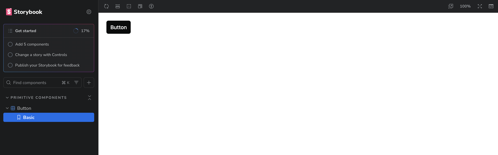
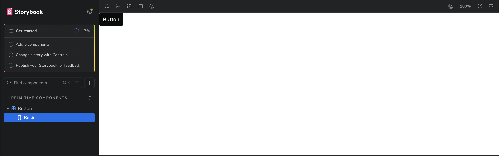

# Yamada-UI styles issue reproduction

This repo provides a small reproduction of the issue.

Lines 11-21 in packages/ui/src/components/primitives/button/button.stories.tsx is the triggering factor to broken styles.

When these lines are commented out, the themes work again.

## Setup

Install using pnpm, and run storybook.

```bash
rm -rf packages/ui/.next packages/ui/node_modules && pnpm i && pnpm -C packages/ui storybook
```

## Images

Lines commented out:



Lines not commented out:


